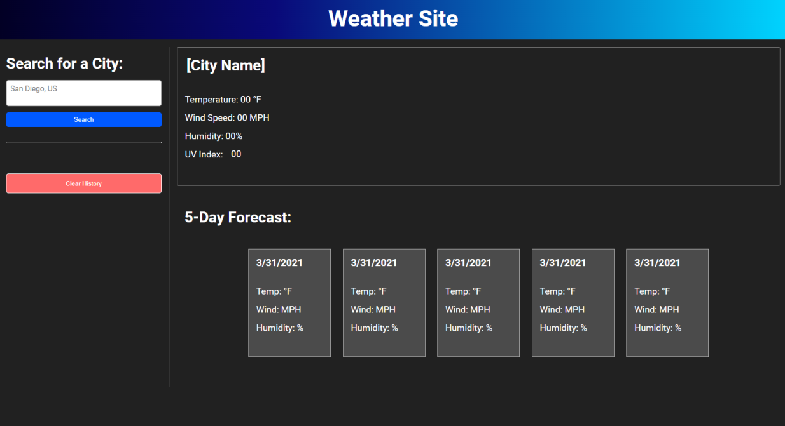
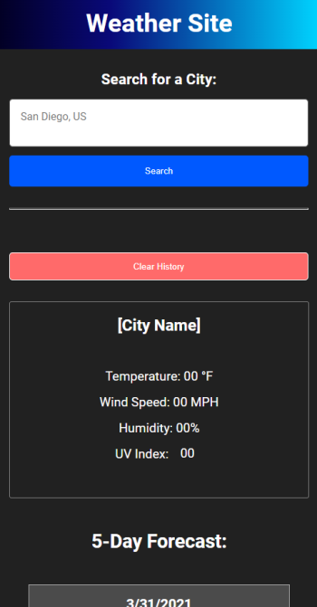

# Weather Site

7/12/2022

## Overview

This website lets the user search up cities and will return their city's temperature, wind speed, humidity, and UV index. It will also display 5 cards showing a 5 day forecast. Their last 8 searches will be saved in their history, and are abled to be clicked to research their saved cities again. The user can also clear their history which will clear all their previous searches and reload the page to update the UI. The UV Index background changes colors based on the City's UV Level. The website is responsive on all devices, and will auto scroll down after searching for mobile users.

## Links

Live Page: https://tdgnate.github.io/weather-site/

## Images

- Desktop

- Mobile

## Questions

_Reach Out!_

Github: [TDGNate](https://github.com/TDGNate)

Email: itsnzte@gmail.com
